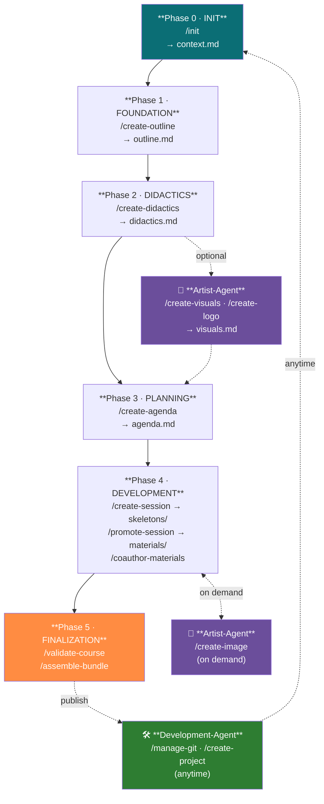

# Teaching-Agent 🎓

> A BMad-Method-powered AI agent for structured lecture development with LiaScript

**Teaching-Agent** helps educators design, structure, and author complete lecture courses through guided, iterative workflows — from initial concept to polished materials.

---

## Table of Contents

- [Philosophy: Spec-Driven Development](#philosophy-spec-driven-development)
- [The BMad Method](#the-bmad-method)
- [Teaching-Agent Workflow](#teaching-agent-workflow)
- [Getting Started](#getting-started)
- [Step-by-Step Usage Guide](#step-by-step-usage-guide)
- [Commands Reference](#commands-reference)
- [Examples](#examples)
- [License](#license)

---


## Philosophy: Spec-Driven Development

Traditional course development often starts with writing content directly — slides, notes, exercises — without a clear roadmap. This leads to:

- **Inconsistent learning objectives** across sessions
- **Misaligned difficulty levels** and pacing
- **Redundant or missing content**
- **Lack of didactic coherence**

**Spec-Driven Development** flips this approach:

1. **Define first, write later**: Start by specifying *what* the course should achieve (learning objectives, audience, scope)
2. **Design didactics deliberately**: Choose teaching methods, style, and persona *before* creating materials
3. **Plan the structure**: Build a complete agenda/schedule with clear session goals
4. **Create iteratively**: Develop materials session-by-session with validation at each step

This ensures **consistency, traceability, and quality** throughout the entire course.

---

## The BMad Method

**BMad (Behavior-Model-Agnostic Design)** is a framework for building specialized AI agents with:

- **Defined personas & roles**: Agents adopt specific expertise and communication styles
- **Task-driven workflows**: Structured, repeatable processes with clear inputs/outputs
- **Template-based outputs**: Consistent document structures across all artifacts
- **Validation & quality checks**: Built-in consistency verification

Teaching-Agent implements BMad principles by:

- **Adopting a supportive teaching planner persona**
- **Following structured tasks** (outline → didactics → agenda → sessions → materials)
- **Using YAML templates** for consistent documentation
- **Validating coherence** between all lecture components

**Learn more:**
- [BMad-Method Framework](https://github.com/bmad-code-org/BMAD-METHOD) — Core methodology
- [Agent Architecture & Configuration](./.github/copilot-instructions.md) — Complete technical specification of the Teaching-Agent (personas, tasks, templates, dependencies)

---

## Teaching-Agent Workflow


Teaching-Agent guides you through **6 phases** — starting with project initialization, then building iteratively toward published materials.



### Key Principles

- **Progressive refinement**: Each phase builds on the previous
- **Interactive dialogue**: The agent asks clarifying questions when needed
- **Instructor persona adoption**: From Phase 2 onward, materials reflect your defined teaching style
- **LiaScript-native**: All materials use LiaScript syntax for interactive, web-based courses

---

## Getting Started

### Prerequisites

- VS Code with GitHub Copilot
- Access to Teaching-Agent (via this workspace)

### Quick Start

```bash
# Open this workspace in VS Code
code /path/to/teaching-agent

# Activate the agent in chat
@teaching-agent /help
```

The agent will introduce itself and show available commands.

---

## Step-by-Step Usage Guide

### Step 1: Create the Lecture Outline

**Command:** `/create-outline`

**What it does:**
- Defines the course title, target audience, and time commitment
- Establishes 3–5 concrete learning objectives
- Writes an abstract summarizing content and benefits
- Optionally creates a logo prompt

**Output:** `docs/lecture-outline.md`

**Example interaction:**
```
You: @teaching-agent /create-outline

Agent: Great! Let's build your lecture outline. I need some information:

1. What is the title of your lecture/course?
2. Who is the target audience? (e.g., beginners, advanced students, professionals)
3. What is the time commitment? (e.g., 14 weeks, 2 hours/week)

You: "Introduction to Machine Learning", undergraduate CS students, 14 weeks, 4 hours/week

Agent: Perfect! Now let's define the abstract...
```

---

### Step 2: Define Didactics & Teaching Style

**Command:** `/create-didactics`

**What it does:**
- Designs the didactic concept (teaching methods, learning phases)
- Creates a professor persona (background, expertise, communication style)
- Sets style & difficulty level (humorous, formal, practical, etc.)
- Defines course type (introductory, advanced, hands-on, self-paced)

**Output:** `docs/lecture-didactics.md`

**Why this matters:**
From this point forward, the agent **adopts your professor persona** when creating materials, ensuring consistent tone and style throughout the course.

---

### Step 3: Build the Lecture Agenda

**Command:** `/create-agenda`

**What it does:**
- Creates a structured schedule of sessions/modules
- For each session: title, duration, type (lecture/exercise), learning objectives, summary
- Links each session to its materials file path

**Output:** `docs/lecture-agenda.md`

**The agent now writes in your professor's voice!**

---

### Step 4: Create Session Skeletons

**Command:** `/create-session {number} {type} {title?}`

**Parameters:**
- `{number}`: Session number (e.g., 1, 2, 3)
- `{type}`: `lecture` or `exercise`
- `{title}`: (Optional) Session title

**What it does:**
- Creates a structured framework for a session
- Includes placeholders for content, activities, and references

**Output:** `skeletons/{number}-{type}.md`

**Example:**
```
@teaching-agent /create-session 1 lecture "Introduction to Neural Networks"
```

---

### Step 5: Promote Skeletons to Full Materials

**Command:** `/promote-session {number} {type}`

**What it does:**
- Converts a skeleton into detailed session materials
- Adds complete outline with subchapters
- Includes references and didactic elements
- Written in professor persona style

**Output:** `materials/{number}-{type}.md`

**Example:**
```
@teaching-agent /promote-session 1 lecture
```

---

### Step 6: Collaborate on Content (Co-Authoring)

**Command:** `/coauthor-materials`

**What it does:**
- Interactive, dialog-based content creation
- Agent acts as co-author in professor persona
- Suggests text, examples, diagrams, and images
- Follows strict LiaScript syntax rules
- Iterative refinement based on your feedback

**Use this when:**
- You want to brainstorm content ideas
- You need help writing in your professor's style
- You want to add interactive elements, quizzes, or animations

**Example workflow:**
```
You: @teaching-agent /coauthor-materials

Agent: I'm ready to co-author materials with you in the professor persona!
        Which session are we working on?

You: Session 1, the introduction section needs more depth

Agent: Got it! Let me suggest some content for the introduction...
```

---

### Step 7: Validate Your Lecture

**Command:** `/validate-lecture`

**What it does:**
- Checks consistency across outline, didactics, agenda, and materials
- Verifies all sessions have materials
- Ensures learning objectives are met
- Confirms numbering and structure

**Output:** `docs/validation-report.md`

---

### Step 8: Assemble the Final Bundle

**Command:** `/assemble-bundle`

**What it does:**
- Collects all documents into a complete package
- Creates an index file
- Generates a distributable bundle

**Output:** `lecture-bundle/` or `.zip`

---

## Commands Reference

| Command                               | Purpose                      | Output                      |
| ------------------------------------- | ---------------------------- | --------------------------- |
| `/help`                               | Show available commands      | —                           |
| `/create-outline`                     | Define course foundation     | `docs/lecture-outline.md`   |
| `/create-didactics`                   | Design teaching approach     | `docs/lecture-didactics.md` |
| `/create-agenda`                      | Structure sessions           | `docs/lecture-agenda.md`    |
| `/create-session {n} {type} {title?}` | Create session skeleton      | `skeletons/{n}-{type}.md`   |
| `/promote-session {n} {type}`         | Expand to full materials     | `materials/{n}-{type}.md`   |
| `/coauthor-materials`                 | Interactive content creation | Refined materials           |
| `/validate-lecture`                   | Check consistency            | `docs/validation-report.md` |
| `/assemble-bundle`                    | Package everything           | `lecture-bundle/`           |
| `/exit`                               | End session                  | —                           |

---

## Examples

### Example: Creating a Machine Learning Course

```
1. @teaching-agent /create-outline
   → Define "Intro to ML" for undergrad students

2. @teaching-agent /create-didactics
   → Set persona: "Practical, encouraging professor with industry experience"
   → Style: Conversational, hands-on, with real-world examples

3. @teaching-agent /create-agenda
   → 14 sessions: 10 lectures + 4 exercises

4. @teaching-agent /create-session 1 lecture "What is Machine Learning?"
   → Build skeleton

5. @teaching-agent /promote-session 1 lecture
   → Generate full materials with examples

6. @teaching-agent /coauthor-materials
   → Add interactive code examples and quizzes

7. @teaching-agent /validate-lecture
   → Check everything is consistent

8. @teaching-agent /assemble-bundle
   → Package for LiaScript deployment
```

---

## License

[CC1.0 Universal]

---

**Ready to build your lecture?** Start with:

```
@teaching-agent /help
```