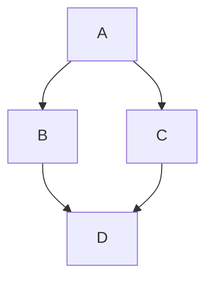

# LiaScript Guide – Syntax, Semantics & Best Practices

## Purpose

A compact reference guide for agents to produce **syntactically and semantically correct LiaScript**.

---

## 1) Course Metadata (Header)

```lia
<!--
author:   Firstname Lastname
email:    user@example.org
version:  1.0.0
language: en
narrator: English Female
comment:  Short description of the course
-->
```

**Notes**

- `language` and `narrator` define TTS/voice output.
- `comment` may be used as an abstract or summary.

---

## 2) Structure: Headings & Sections

```lia
# Main Title (Course Title Page)
## Section
### Subsection
```

**Rules**

- Only one `#` heading per file (the course title).
- Use hierarchical structure logically; avoid “jumps” in heading levels.

---

### Additional Rule: Subheadings within a Slide

- Each `##` heading **always starts a new slide**.

- Subheadings (`###` to `######`) are generally **allowed**, but:

  - They may **not appear freely**.
  - They are only allowed if **embedded** inside:

    - an **HTML block** (`<div>…</div>`)
    - a **list** (`-`, `*`)
    - a **blockquote** (`>`)

- A “naked” subheading outside such containers counts as a new slide/segment and is therefore **not allowed**.

**Allowed patterns:**

```lia
## Slide 1

<div>
### Subsection inside an HTML block
#### One level deeper
</div>
```

```lia
## Slide 2

- List with content
  - ### Subheading inside a list
    #### One level deeper
```

```lia
## Slide 3

> ### Subheading in a blockquote
> #### Deeper level in the blockquote
```

**Not allowed (outside of containers):**

```lia
## Slide 4

### Subheading without container   ❌
#### Even deeper without container ❌
```

---

## 3) Text, Lists, Quotes

```lia
Normal text with **bold** and *italic*.

- List item 1
- List item 2

> Quote / Key takeaway
```

**Tip:** Short paragraphs, learner-friendly phrasing.

---

## 4) Presentation Mode & Speech Output

### Optimized Rules: Presentation Mode & Speech Output

1. **Slide Structure**

   - Every `##` heading creates a **new slide**.
   - After each new slide (`##`), the **animation/comment numbering** (`--{{n}}--`, `{{n}}`) resets to **0**.
   - Headings within `<div>…</div>`, lists, or blockquotes do **not** start new slides.

2. **Animations**

   - Each animation is controlled with `--{{n}}--` (comment/TTS) or `{{n}}` (visible content).
   - Numbering starts at 0 for each slide.
   - Ranges `{{a-b}}` mean: content appears at step `a` and disappears at step `b`.

3. **Speech Output (TTS)**

   - Each `--{{n}}--` block contains a **spoken comment** read aloud during the corresponding animation step.
   - Comments should sound like **explanatory sentences**, not bullet points.
   - **Optional:** `{{|>}}` creates a play button for manual playback.
   - The voice is defined in the header (`narrator`) but can be overridden per section via comment:

     ```lia
     <!--
     narrator: English UK Female
     -->
     ```

4. **Style**

   - Structure each slide **like a PowerPoint slide**: clear title, short text, matching speaker comments.
   - Each animated block should have its **own** TTS comment.
   - Avoid long text blocks: maximum **one paragraph per animation**.

---

### Minimal Example (Optimized)

```lia
## Slide 5

    --{{0}}--
Introductory text read at slide start.

    --{{1}}--
This is read during the first animation step.

      {{1}}
> Quote appears at step 1.

    --{{2}}--
In the second step, a table is displayed.

      {{2-3}}
<div>
### Table inside HTML block (no slide switch)

| Column A | Column B |
|----------|----------|
| Value 1  | Value 2  |

</div>

    --{{3}}--
Closing comment. The next slide starts again at 0.
```

---

## 5) Media: Images, Audio, Video, oEmbed

Multimedia links can be included locally (relative paths) or externally (URLs).

```lia


?[Audio / Link text](assets/audio/intro.mp3 "Optional audio caption")

!?[Video / Link text](https://www.youtube.com/watch?v=dQw4w9WgXcQ "Optional video caption")

??[oEmbed / Link text](https://example.org/resource "Optional oEmbed caption")
```

**Accessibility (A11y)**

- Meaningful alt text and descriptive filenames.
- For external videos: provide a brief summary.

---

**Galleries** can be created by adding multiple media elements in sequence:

```lia

?[Audio / Link text](assets/audio/intro.mp3 "Optional audio caption")
!?[Video / Link text](https://www.youtube.com/watch?v=dQw4w9WgXcQ "Optional video caption")
??[oEmbed / Link text](https://example.org/resource "Optional oEmbed caption")
```

---

## 6) Diagrams

Diagrams can be created using Mermaid. The `@mermaid` tag ensures proper rendering.

````lia

````

Alternatively, diagrams can be created with ASCII art. The syntax info `ascii` ensures correct formatting.

````lia
```ascii  Optional subtitle
  +---+      +---+
  | A | *--> | B |
  +---+      +---+
    ^          ^
    |          |
    |   .------'
    v  /
  +---+
  | C |
  +---+
```
````

---

## 7) Formulas & Equations

Mathematical formulas use LaTeX syntax.

Inline formula: $E = mc^2$

Block formula as separate paragraph:

$$
\sum_{i=1}^{n} i = \frac{n(n+1)}{2}
$$

---

## 8) Code & Execution

````lia
```js
console.log("Hello LiaScript!");
```
````

**Note:** Use correct language tags (`js`, `py`, `html`, etc.).

For interactive code with input fields, attach a `<script>` block or macro directly after the code block:

````lia
```js
console.log("Hello LiaScript!");
```
<script>
@input
</script>
````

---

## 9) Tables

```lia
| Era      | Feature         | Example      |
|----------|-----------------|---------------|
| Antiquity| Aulos, Lyre     | Seikilos Song |
| Baroque  | Basso continuo  | J. S. Bach    |
```

---

## 10) Quizzes & Interaction

**Single Choice**

```lia
Who composed the 9th Symphony?

- [( )] Mozart
- [(X)] __Beethoven__
- [( )] Haydn
```

**Multiple Choice**

```lia
Select all Baroque composers.

- [[X]] Bach
- [[X]] Handel
- [[ ]] Debussy
```

**Text Quiz**

```lia
Composer of the 9th:

[[Beethoven]]
```

**Open Question**

```lia
?[Briefly explain: Why was the Marseillaise politically significant?]
```

**Tips**

- One question = one learning goal.
- Optional feedback (explanation after the answer).

---

## 10b) Surveys – Feedback without Solutions

Surveys are like quizzes but **without a correct answer** — you provide a placeholder or options instead of a solution. State is stored if the course version is ≥ 1.0.0.

### Text Input

Single-line (comma-separated input):

```lia
[[___]]
```

Multi-line textarea — the **number of `___` groups** defines the number of lines:

```lia
[[___ ___ ___]]
```

---

### Single-Choice Vector

Uses **numbers or labels** in parentheses. Numbers → distribution plot in classroom; text labels → categorical chart.

```lia
How do you rate this session?

[(1)] Excellent
[(2)] Good
[(3)] Neutral
[(4)] Poor
```

Or with text labels:

```lia
[(very good)]  I like it very much
[(good)]       It is ok
[(bad)]        I don't like it
```

---

### Multi-Choice Vector

Uses **labels** in double square brackets. Labels only → categorical; start with numbers → continuous.

```lia
Which topics were useful?

[[theory]]    Theory part
[[examples]]  Code examples
[[exercises]] Exercises
```

With numbers (continuous scale):

```lia
[[1 theory]]    Theory part
[[2 examples]]  Code examples
[[3 exercises]] Exercises
```

---

### Single-Choice Matrix

Define a **header row** of options in parentheses, then one row per question with empty brackets:

```lia
[(strongly agree)(agree)(neutral)(disagree)(strongly disagree)]
[                                                             ] The pace was appropriate.
[                                                             ] The examples were helpful.
[                                                             ] I would recommend this course.
```

With numbered labels for distribution charts:

```lia
[(1 strongly agree)(2 agree)(3 neutral)(4 disagree)(5 strongly disagree)]
[                 ] The pace was appropriate.
[                 ] The examples were helpful.
```

---

### Multi-Choice Matrix

Same structure as single-choice matrix, but uses **double brackets** in header and body:

```lia
[[1][2][3][4][5]]
[             ] I understood the learning objectives.
[             ] I could apply the content right away.
[             ] I would like more exercises.
```

---

### Surveys and Scripting

Attach a `<script>` to validate or forward the input (same as quizzes):

```lia
Please describe your main takeaway:

[[___]]
<script>
  let input = `@input`.trim()
  if (input.length > 4) {
    true
  } else if (input.length == 0) {
    send.lia("Please enter some text.", [], false)
  } else {
    send.lia("Please provide a more detailed answer.", [], false)
  }
</script>
```

**`@input` values per type:**
- Text input → string
- Single-choice vector → number (index, -1 if nothing selected)
- Multi-choice vector → array of 0/1 values
- Single-choice matrix → array of numbers
- Multi-choice matrix → array of arrays

---

## 11) Including External Content

```lia
@import(./snippets/task.md)
@include(https://example.org/note.md)
```

- Use `@import` for local fragments, `@include` for external sources.

---

## 12) Variables & Simple Macros

```lia
<!--
@myvar: __Music History__
-->

# Title

Welcome to the @myvar course!
```

---

## 13) Example Task Pattern

```lia
## Task: Source Analysis (Marseillaise)

1. Read the text (excerpt linked).
2. Highlight political keywords.
3. Answer:

   Which theme dominates?

   - [(X)] Freedom
   - [( )] Romanticism
   - [( )] Commerce

> Reflection: 2–3 sentences on its impact on contemporaries.
```

**Learning goal:** Clearly state what the task aims to achieve.

---

## 14) Audio-Supported Sections

The animation pattern `{{|>}}` creates a play button. When clicked, the section below is read aloud via TTS.

```lia
    {{|>}}
This section will be read aloud when the play button is clicked.
```

**Note:** The `narrator` in the header defines the voice for speech output, but it can be overridden per section:

```lia
...

## Section 3
<!--
narrator: English UK Female
-->

    --{{1}}--
I will be read aloud in English during the first animation step.

    {{|> Russian Female 1-2}}
This section will be read in Russian when the play button is clicked, visible only between animation steps 1 and 2.
```

---

## 15) Accessibility (A11y) – Quick Checklist

- [ ] Alt text for all media
- [ ] Clear language, short sentences
- [ ] Maintain contrast/readability (for embedded HTML/CSS)
- [ ] Audio/video have short content summaries
- [ ] Logical navigation (heading hierarchy)

---

## 16) Common Mistakes & Pitfalls

- ❌ Unclosed code blocks (always open/close with three backticks)
- ❌ Wrong heading order (`###` without preceding `##`)
- ❌ Media without alt text
- ❌ Ambiguous or unclear quiz questions
- ❌ Overly long sections without structure

---

## 17) Mini Validation Before Export

- [ ] All code blocks properly closed
- [ ] Exactly **one** course title with `#`
- [ ] External links checked
- [ ] Quiz questions tested
- [ ] Course header metadata completed

---

## 18) Minimal Example (Structure)

````lia
<!--
author:   Erika Example
email:    erika@example.org
version:  1.0.0
language: en
narrator: English Female
-->

# Music & History – Introduction

## Antiquity

    --{{0}}--
Brief overview of antiquity.

    --{{1}}--
Which instruments existed in antiquity? Check the correct one.

      {{1}}
<div>
Instrument of antiquity?

- [(X)] Aulos
- [( )] Synthesizer
</div>

## Baroque

--{{0}}--
Run the following JavaScript example:

```js
console.log("Basso continuo = foundation");
```
<script>
@input
</script>
````